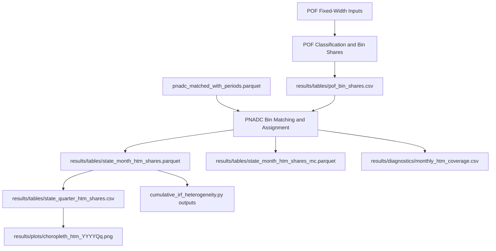

# ImHANKingIt

ImHANKingIt is a research pipeline for classifying Brazilian households into Hand-to-Mouth (HtM) agent types using the Kaplan-Violante-Weidner framework, then transferring those type probabilities to PNADC data to build a monthly state panel.

The three agent types are:
- `PH2M` (Poor Hand-to-Mouth)
- `WH2M` (Wealthy Hand-to-Mouth)
- `Ricardian`

The repository is organized around a canonical monthly workflow:
1. Calibrate type shares on POF 2017-18 microdata.
2. Match those shares to PNADC records via common demographic bins.
3. Produce state-month expected shares (canonical output).
4. Optionally produce legacy quarterly outputs and choropleths.
5. Use monthly outputs downstream for IRF heterogeneity analysis.

## Quick Start

### 1) Install dependencies

```bash
pip install -r requirements.txt
```

### 2) Run the canonical monthly pipeline

```bash
python3 htm_classification.py
```

### 3) Verify key outputs

After a successful run, check that these exist:
- `results/tables/pof_bin_shares.csv`
- `results/tables/state_month_htm_shares.parquet` (canonical)
- `results/tables/state_month_htm_shares_mc.parquet` (diagnostic)
- `results/diagnostics/monthly_htm_coverage.csv`
- `results/tables/state_quarter_htm_shares.csv` (legacy aggregate, unless disabled)

## Repository Approach

Use this section as the practical entry point for working in the repo.

### If your goal is to run baseline HtM shares
- Run `python3 htm_classification.py`.
- Start from `results/tables/state_month_htm_shares.parquet` for analysis.
- Use `results/diagnostics/monthly_htm_coverage.csv` to inspect exclusions and match coverage.

### If your goal is to regenerate maps only
- Ensure `results/tables/state_quarter_htm_shares.csv` exists.
- Run `python3 generate_choropleths.py`.
- Read outputs in `results/plots/` as `choropleth_htm_YYYYQq.png`.

### If your goal is IRF heterogeneity analysis
- Run `python3 cumulative_irf_heterogeneity.py`.
- The script reads monthly HtM shares from `results/tables/state_month_htm_shares.parquet`.
- If monthly parquet is missing, it falls back to interpolation from `results/tables/state_quarter_htm_shares.csv`.

### If your goal is data-prep or utility scripting
- Put prep helpers in `scripts/data_prep/`.
- Put reporting scripts in `scripts/reporting/`.
- Put one-off utilities in `scripts/utils/`.
- Keep exploratory work in `analysis/`.
- Keep superseded scripts in `archive/legacy/`.

### If your goal is schema or input validation work
- Use `PNADC_REQUIRED_VARIABLES.md` as the schema contract for PNADC inputs.
- Use `RESULTS_PROVENANCE.md` for artifact-to-producer mapping and rerun commands.

## Architecture and Data Flow



## Canonical Entry Points

- `htm_classification.py`: end-to-end calibration and monthly assignment pipeline.
- `generate_choropleths.py`: standalone map generation from quarterly table.
- `cumulative_irf_heterogeneity.py`: monthly state IRF heterogeneity workflow.

Supporting docs:
- `scripts/README.md`: script organization and workflow guardrails.
- `RESULTS_PROVENANCE.md`: generated artifact ownership and rerun mapping.
- `PNADC_REQUIRED_VARIABLES.md`: required and optional PNADC variables.

## Inputs and Required Data

### POF calibration inputs
Expected under `Data/Dados_20230713/` and `Data/Documentacao_20230713/`:
- `DOMICILIO.txt`
- `MORADOR.txt`
- `RENDIMENTO_TRABALHO.txt`
- `OUTROS_RENDIMENTOS.txt`
- `ALUGUEL_ESTIMADO.txt`
- `Dicionarios de variaveis.xls`

### PNADC monthly input
- Default input: `pnadc_matched_with_periods.parquet` (repo root).
- Override with `--pnad-parquet /path/to/file.parquet`.

See `PNADC_REQUIRED_VARIABLES.md` for full variable inventory and branch-specific expectations.

## Runbook by Task

### Full monthly classification run

```bash
python3 htm_classification.py
```

### Faster run without choropleths

```bash
python3 htm_classification.py --no-choropleth
```

### Run with custom PNADC parquet

```bash
python3 htm_classification.py --pnad-parquet /path/to/pnadc_matched_with_periods.parquet
```

### Use per-quarter quintiles for assignment

```bash
python3 htm_classification.py --per-quarter-quintiles
```

### Skip generating legacy quarterly aggregate

```bash
python3 htm_classification.py --no-legacy-quarterly
```

### Regenerate choropleths only

```bash
python3 generate_choropleths.py --input results/tables/state_quarter_htm_shares.csv --output-dir results/plots
```

### Run monthly IRF heterogeneity pipeline

```bash
python3 cumulative_irf_heterogeneity.py
```

## Outputs You Should Know

### Core HtM outputs
- `results/tables/pof_bin_shares.csv`
- `results/tables/state_month_htm_shares.parquet`
- `results/tables/state_month_htm_shares_mc.parquet`
- `results/diagnostics/monthly_htm_coverage.csv`
- `results/tables/state_quarter_htm_shares.csv` (legacy compatibility)

### Secondary outputs
- `results/plots/choropleth_htm_YYYYQq.png`
- `results/tables/irf_state_level/*.csv`
- `results/plots/irf_state_level/*.png`

For complete output provenance, read `RESULTS_PROVENANCE.md`.

## Testing and Validation

Run the test suite:

```bash
pytest tests/
```

Useful targeted tests:

```bash
pytest tests/test_htm_monthly_batch.py -v
pytest tests/test_htm_quintiles.py -v
pytest tests/test_pnad_faixa_pretreat.py -v
```

What to validate after pipeline changes:
- Type shares sum correctly at expected aggregation levels.
- Coverage diagnostics in `results/diagnostics/monthly_htm_coverage.csv` remain plausible.
- Monthly output schema and key columns remain stable for downstream IRF scripts.

## Troubleshooting

### `PNADC Parquet not found`
- Ensure `pnadc_matched_with_periods.parquet` exists in repo root.
- Or pass `--pnad-parquet` with an explicit path.

### Choropleth generation fails
- Confirm geospatial dependencies are installed from `requirements.txt`.
- Check network access for IBGE boundary download.
- If needed, skip map generation with `--no-choropleth` and run maps later.

### Schema mismatch errors during PNADC stage
- Validate columns and types against `PNADC_REQUIRED_VARIABLES.md`.
- Confirm your input parquet is a monthly matched panel expected by current pipeline logic.

### Downstream IRF script cannot use monthly shares
- Verify `results/tables/state_month_htm_shares.parquet` exists.
- Otherwise confirm legacy quarterly file exists for fallback interpolation.

## Contributing and Repository Hygiene

- Keep canonical run targets at root (`htm_classification.py`, `generate_choropleths.py`, `cumulative_irf_heterogeneity.py`).
- Place new non-canonical scripts under `scripts/` by purpose.
- Keep exploratory analysis in `analysis/` and older superseded files in `archive/legacy/`.
- Prefer updating documentation when changing inputs, outputs, or command-line behavior.
- Log major repository updates in `development_status.md`.

## Related Documentation

- `development_status.md`: change log of major updates.
- `RESULTS_PROVENANCE.md`: output provenance and rerun mapping.
- `PNADC_REQUIRED_VARIABLES.md`: PNADC schema contract.
- `scripts/README.md`: script placement and workflow guardrails.
- `CLAUDE.md`: project architecture and developer guidance.
